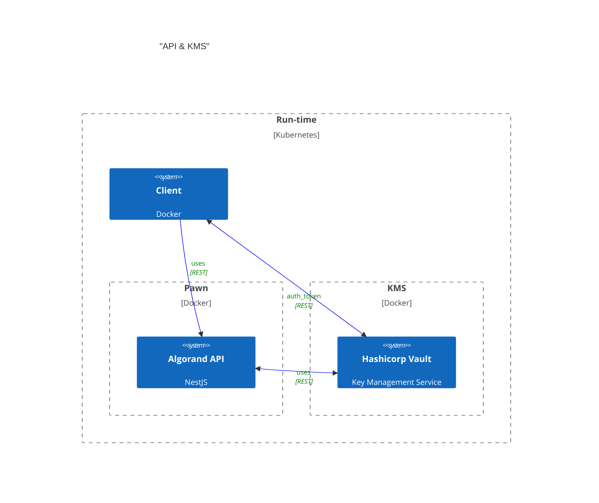

# Pawn

## Conceptual Architecture

This pattern ensure that applications comply with the principle of **ISOLATION** between appliation space and "trusted" space; i.e the KMS.
Most web3 applications handle cryptographic keys in-memory and in the same run-time space as the application. This is a security risk as the keys can be easily compromised by an attacker who gains access to the application's memory space.

This ensures that if the application is compromised, the keys are still secure and cannot be accessed by the attacker.

### Integration

Integration expects the client to use REST to communicate and request actions such as creating assets, transferring assets, etc. The client will send a request to the application, which will then forward the request to the KMS for key gen and signing.



# Setup Development Environment

## Build and run docker
```bash
docker compose up -d --build;
```

Now you can open to see endpoint documentation at http://localhost:3000/docs/

## Setup Vault Keys

```bash
docker compose exec pawn yarn run vault:development:init;
```
You have to unseal vault and get tokens.
Note that, every time you restart the vault container, you need to unseal, which means you need to run this command.
This command's output will provide you 4 important pieces of information:
    1) Vault Root Token
    2) Token for "pawn_managers_approle"
    3) Token for "pawn_users_approle"
    4) Manager's public Algorand address

You can re-run `vault:development:init` whenever you want.


# Authentication (During Development)

1. Copy the `role_id` and `secret_id` tokens from `pawn_managers_approle` or `pawn_users_approle` where you obtained `vault:development:init`.

2. Get a JWT `auth`.`client_token` using the vault's `/v1/auth/approle/login` endpoint (http://localhost:8200/v1/auth/approle/login).

```
POST http://localhost:8200/v1/auth/approle/login

{
  "role_id": "3ab5dada-ec1d-34a6-19ed-d63c9f6eba9c",
  "secret_id": "e857e495-48b2-ab69-3cd1-99f6fe44ccc1"
}
```

3. Use this `client_token` and get a JWT `access_token` for pawn's sign-in endpoint.

```
POST http://localhost:3000/v1/auth/sign-in/

{
    "vault_token": "{your_client_token_will_be_here}"
}
```

4. Add your `access_token` to every endpoint in the header like:

```
Authorization: Bearer {access-token}
```

# TESTING

## Unit Tests

```
yarn test
```

## Integration Tests

1) Adding some ALGO to manager:

If your manager address does not have enough ALGO, you need to add some ALGO to run integration tests.

You should have seen the manager address in the `Setup Vault Keys` step.
You can also find the manager address using the `/v1/wallet/manager/` endpoint. You need the manager's `access_token`.
```
GET http://localhost:3000/v1/wallet/manager/
Authorization: Bearer {your-manager-access-token}
```

You can use https://bank.testnet.algorand.network/ to dispense some ALGO.

2) Run tests:

```
yarn test:e2e
```


# Fresh Restart

Since there are vault volumes and side effects of the `vault:development:init` process, if you need a fresh restart, you might want to remove volumes and side effects.

```
sudo rm -rf volumes node_modules dist data;
sudo rm vault-seal-keys.json package-lock.json manager-role-and-secrets.json user-role-and-secrets.json;
```
